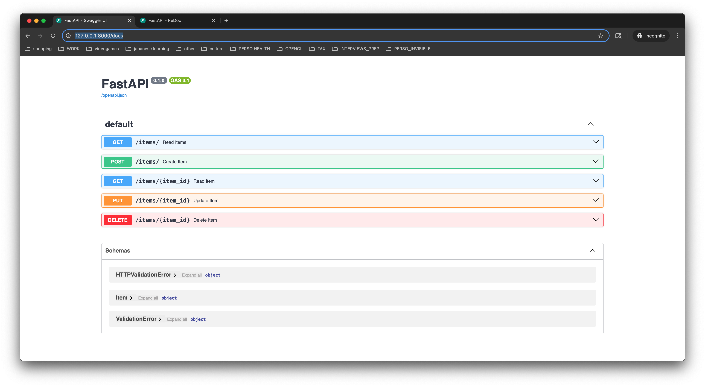
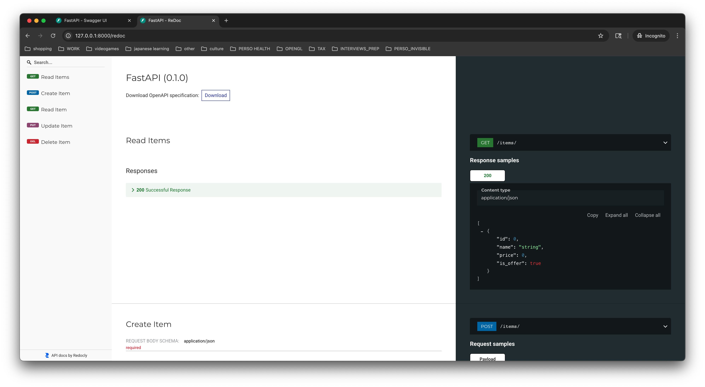
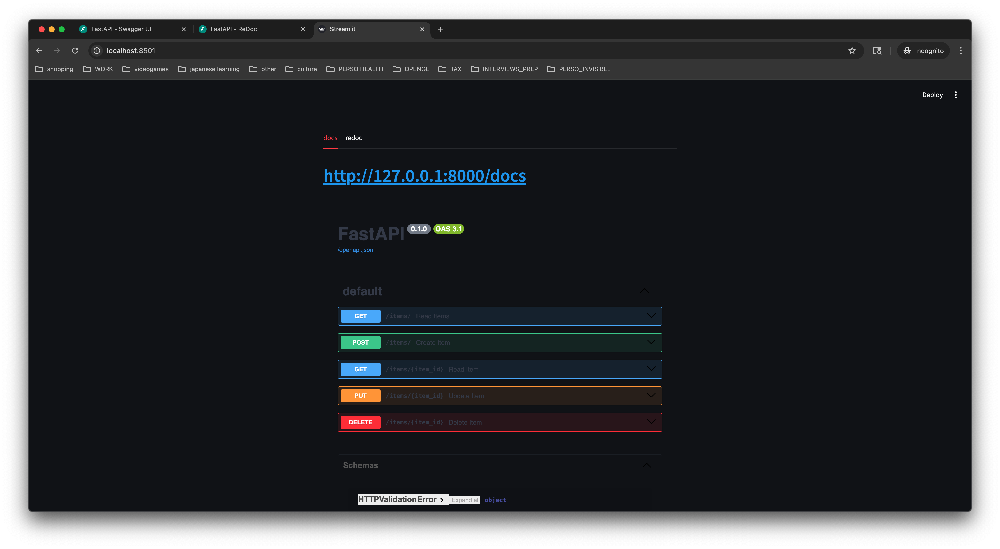
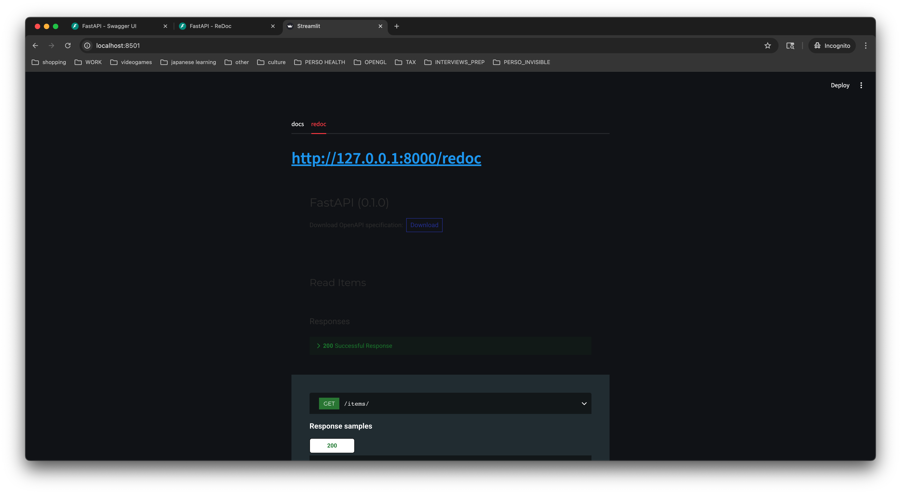

# fastapi-darkmode
a streamlit skin for fastapi docs darkmode

# Motivation
FastAPI swagger can be [customized](https://fastapi.tiangolo.com/how-to/configure-swagger-ui/) but I didn't find a dark mode option.

```python
app = FastAPI(swagger_ui_parameters={"syntaxHighlight": False})
```

## How to
```console
uv run streamlit run main.py
```

This `streamlit` skin is to avoid the flashbang every time I use the `docs` page to check the endpoints 

# How it works
- the fastapi app starts as a `subprocess`
- the swagger UI is then accessed when the streamlit app starts via an `iframe`

```python
if __name__ =="__main__":
    external_process = start_external_app()
    st.iframe("http://127.0.0.1:8000/docs", height=800, width=800) # default running http://127.0.0.1:8000
```

## native FastAPI swagger
- nothing change here
- i haven't change the default settings, the app will start by default to `localhost:8000`

```python
uvicorn fastapi_app:app --reload
```
### Docs


### Redoc


- note that I'm using `Chrome darkmode`
- `redoc` already displays some dark parts

## Streamlit _swagger_
- by default a streamlit app starts at `localhost:8501`
- the script provided shows both the `docs` and `redocs` as 2 different tabs

### Docs


### Redoc


### `Get`, `Post` endpoints


